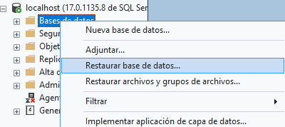
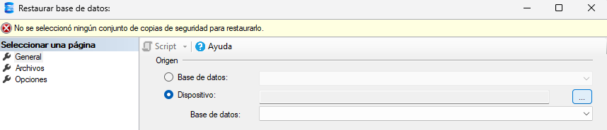

# DP-800 Laboratorio 02 - Implement programmability objects with SQL

**Enlace teoría:** https://learn.microsoft.com/en-us/training/modules/implement-programmability-objects/
**Enlace ejercicio:** https://microsoftlearning.github.io/mslearn-sql-developer/Instructions/Labs/02-implement-programmability-objects.html

**Autor:** Christian Salguero Varas
**Fecha:** 21/09/2026

---

## 1. Restauración de la base de datos

Accedemos a esta página web https://learn.microsoft.com/en-us/sql/samples/adventureworks-install-configure?view=sql-server-ver17&tabs=ssms .

Bajando un poco veremos una tabla con ficheros con nombre AdventureWorks2025.bak.


Nos descargamos el primero fichero de la columna Lightweight.

Para restaurarla abrimos nuestro SSMS, hacemos click derecho en ‘Bases de datos’ o ‘Databases’ y pulsamos en ‘Restaurar base de datos’.



Se abrirá una ventana en la que debemos marcas ‘Dispositivo’ y pulsar los tres puntitos.



Se abrirá otra ventana en la que debemos pulsas ‘Agregar’ y seleccionar el fichero que acabamos de descargar.


Pulsamos en ‘Aceptar’ y se nos completarán todos los campos automáticamente por lo que solo queda pulsar de nuevo en ‘Aceptar’.

---

## 2. Verificar la conexión con la base de datos

```sql
 -- Verify key tables in AdventureWorksLT
 SELECT TOP (5) CustomerID, FirstName, LastName 
 FROM SalesLT.Customer;
    
 SELECT TOP (5) SalesOrderID, OrderDate, CustomerID 
 FROM SalesLT.SalesOrderHeader;
    
 SELECT TOP (5) ProductID, Name, ListPrice 
 FROM SalesLT.Product;
```

---

## 3. Creación de una vista para simplificar las consultas

```sql
 CREATE OR ALTER VIEW SalesLT.vCustomerOrders AS
 SELECT 
     c.CustomerID,
     CONCAT(c.FirstName, ' ', c.LastName) AS CustomerName,
     h.SalesOrderID,
     h.OrderDate
 FROM SalesLT.Customer c
 INNER JOIN SalesLT.SalesOrderHeader h ON c.CustomerID = h.CustomerID;
```

```sql
 SELECT TOP (5) * 
 FROM SalesLT.vCustomerOrders 
 ORDER BY OrderDate DESC;
```

---

## 4. Crear un procedimiento almacenado para procesar un pedido

```sql
 CREATE OR ALTER PROCEDURE dbo.AddOrderLineItem
 	@SalesOrderID INT,
 	@ProductID    INT,
 	@Quantity     INT
 AS
 BEGIN
 	SET NOCOUNT ON;
 	BEGIN TRANSACTION;
    
 	-- Use Product ListPrice as UnitPrice
 	DECLARE @UnitPrice DECIMAL(18,2);
 	SELECT @UnitPrice = CAST(ListPrice AS DECIMAL(18,2))
 	FROM SalesLT.Product
 	WHERE ProductID = @ProductID;
    
 	IF @UnitPrice IS NULL
 	BEGIN
 		ROLLBACK TRANSACTION;
 		THROW 50010, 'Invalid ProductID specified.', 1;
 	END
    
 	-- Ensure SalesOrderID exists
 	IF NOT EXISTS (SELECT 1 FROM SalesLT.SalesOrderHeader WHERE SalesOrderID = @SalesOrderID)
 	BEGIN
 		ROLLBACK TRANSACTION;
 		THROW 50011, 'Invalid SalesOrderID specified.', 1;
 	END
    
 	-- Insert line item (no discount)
 	INSERT INTO SalesLT.SalesOrderDetail (SalesOrderID, OrderQty, ProductID, UnitPrice, UnitPriceDiscount)
 	VALUES (@SalesOrderID, @Quantity, @ProductID, @UnitPrice, 0);
    
 	-- Update header subtotal based on current line totals
 	UPDATE h
 	SET SubTotal = d.SumLineTotal,
 		ModifiedDate = SYSUTCDATETIME()
 	FROM SalesLT.SalesOrderHeader h
 	INNER JOIN (
 		SELECT SalesOrderID, SUM(LineTotal) AS SumLineTotal
 		FROM SalesLT.SalesOrderDetail
 		WHERE SalesOrderID = @SalesOrderID
 		GROUP BY SalesOrderID
 	) d ON d.SalesOrderID = h.SalesOrderID;
    
 	COMMIT TRANSACTION;
 END;
```

```sql
 -- Add a line item to an existing order (choose a valid SalesOrderID)
 DECLARE @SalesOrderID INT = (SELECT TOP 1 SalesOrderID 
                             FROM SalesLT.SalesOrderHeader 
                             ORDER BY SalesOrderID DESC);
 EXEC dbo.AddOrderLineItem @SalesOrderID = @SalesOrderID,         
                             @ProductID = 680, 
                             @Quantity = 1; -- adjust ProductID as needed
    
 SELECT TOP (5) * 
 FROM SalesLT.SalesOrderDetail 
 WHERE SalesOrderID = @SalesOrderID 
 ORDER BY SalesOrderDetailID DESC;

 SELECT SalesOrderID, SubTotal, TaxAmt, Freight, TotalDue 
 FROM SalesLT.SalesOrderHeader 
 WHERE SalesOrderID = @SalesOrderID;
```

---

## 5. Crear una función escalar para cálculos reutilizables

```sql
     CREATE OR ALTER FUNCTION dbo.fnOrderTotal (@OrderID INT)
     RETURNS DECIMAL(18,2)
     AS
     BEGIN
     	DECLARE @Total DECIMAL(18,2);

     	SELECT @Total = SUM(LineTotal)
     	FROM SalesLT.SalesOrderDetail
     	WHERE SalesOrderID = @OrderID;

     	RETURN ISNULL(@Total, 0.00);
     END;
```

```sql
 SELECT d.SalesOrderID, dbo.fnOrderTotal(d.SalesOrderID) AS OrderTotal
 FROM SalesLT.SalesOrderDetail d
 GROUP BY d.SalesOrderID
 ORDER BY d.SalesOrderID DESC;
```

---

## 6. Crear una función con valor de tabla en líneas (TVF)

```sql
 CREATE OR ALTER FUNCTION dbo.GetCustomerOrders (@CustomerID INT)
 RETURNS TABLE
 AS
 RETURN
 (
 	SELECT 
 		h.SalesOrderID,
 		h.OrderDate
 	FROM SalesLT.SalesOrderHeader h
 	WHERE h.CustomerID = @CustomerID
 );
```

```sql
 SELECT * 
 FROM dbo.GetCustomerOrders(29929)
 ORDER BY OrderDate DESC;
```

```sql
 SELECT CONCAT(c.FirstName, ' ', c.LastName) AS CustomerName, o.SalesOrderID, o.OrderDate
 FROM SalesLT.Customer c
     CROSS APPLY dbo.GetCustomerOrders(c.CustomerID) o
 WHERE c.CustomerID = 29929;
```

---

## 7. Crear un desencadenador (trigger) para registrar cambios

```sql
 -- Audit table
 IF OBJECT_ID('dbo.OrderAudit') IS NULL
 BEGIN
     CREATE TABLE dbo.OrderAudit (
         AuditID     INT IDENTITY(1,1) PRIMARY KEY,
         OrderID     INT NOT NULL,
         OldTotal    DECIMAL(18,2) NULL,
         NewTotal    DECIMAL(18,2) NULL,
         ChangedAt   DATETIME2 NOT NULL DEFAULT SYSUTCDATETIME()
     );
 END
 GO

 -- Trigger on order details updates
 CREATE OR ALTER TRIGGER SalesLT.trg_LogOrderTotalChange
 ON SalesLT.SalesOrderDetail
 AFTER INSERT, UPDATE
 AS
 BEGIN
     SET NOCOUNT ON;

     ;WITH AffectedOrders AS (
         SELECT SalesOrderID FROM inserted
         UNION
         SELECT SalesOrderID FROM deleted
     ),
     -- New totals from the base table (already reflects changes)
     NewTotals AS (
         SELECT d.SalesOrderID, SUM(d.OrderQty * d.UnitPrice) AS Total
         FROM SalesLT.SalesOrderDetail d
         INNER JOIN AffectedOrders a ON d.SalesOrderID = a.SalesOrderID
         GROUP BY d.SalesOrderID
     ),
     -- Contribution of the newly inserted/updated rows
     InsertedTotals AS (
         SELECT SalesOrderID, SUM(OrderQty * UnitPrice) AS Total
         FROM inserted
         GROUP BY SalesOrderID
     ),
     -- Contribution of the previous row versions (empty on INSERT)
     DeletedTotals AS (
         SELECT SalesOrderID, SUM(OrderQty * UnitPrice) AS Total
         FROM deleted
         GROUP BY SalesOrderID
     )
     INSERT INTO dbo.OrderAudit (OrderID, OldTotal, NewTotal)
     SELECT
         n.SalesOrderID,
         n.Total - ISNULL(i.Total, 0) + ISNULL(d.Total, 0) AS OldTotal,
         n.Total AS NewTotal
     FROM NewTotals n
     LEFT JOIN InsertedTotals i ON n.SalesOrderID = i.SalesOrderID
     LEFT JOIN DeletedTotals d ON n.SalesOrderID = d.SalesOrderID;
 END;
```

```sql
 -- Update an order detail to change the total
 UPDATE d
 SET OrderQty = OrderQty + 1
 FROM SalesLT.SalesOrderDetail d
 WHERE d.SalesOrderID = (SELECT TOP 1 SalesOrderID FROM SalesLT.SalesOrderHeader ORDER BY SalesOrderID DESC);
    
 SELECT TOP (5) * 
 FROM dbo.OrderAudit 
 ORDER BY AuditID DESC;
```